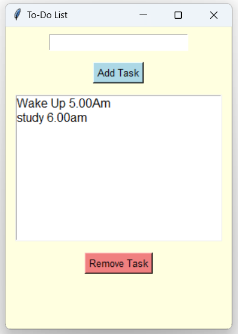

# baskartech_Academy

# 📝 To-Do List App using Python Tkinter

This is a simple GUI-based To-Do List app built using **Python** and **Tkinter**. The app allows users to add and remove tasks in a user-friendly interface.

## 💡 Features
- ✅ Add new tasks
- ❌ Remove existing tasks
- 🎨 Clean UI with light yellow background
- 🧠 Built with beginner-friendly code

## 📸 Demo


## 🧾 Code

```python
import tkinter as tk
from tkinter import messagebox

tasks = []

def add_task():
    task = entry.get()
    if task:
        tasks.append(task)
        listbox.insert(tk.END, task)
        entry.delete(0, tk.END)
    else:
        messagebox.showwarning("Input Error", "Please enter a task!")

def remove_task():
    selected = listbox.curselection()
    if selected:
        index = selected[0]
        listbox.delete(index)
        tasks.pop(index)
    else:
        messagebox.showwarning("Selection Error", "Please select a task to remove!")

root = tk.Tk()
root.title("To-Do List")
root.geometry("300x400")
root.configure(bg="lightyellow")

entry = tk.Entry(root, font=("Poppins", 12))
entry.pack(pady=10)

add_btn = tk.Button(root, text="Add Task", command=add_task, bg="lightblue", font=("Poppins", 10))
add_btn.pack(pady=5)

listbox = tk.Listbox(root, font=("Poppins", 12), width=30, height=10)
listbox.pack(pady=10)

remove_btn = tk.Button(root, text="Remove Task", command=remove_task, bg="lightcoral", font=("Poppins", 10))
remove_btn.pack(pady=5)

root.mainloop()

